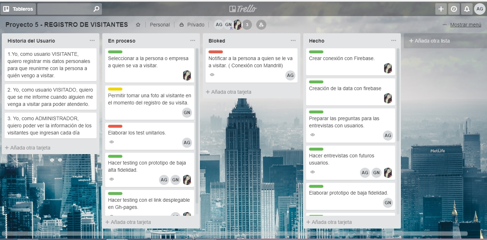
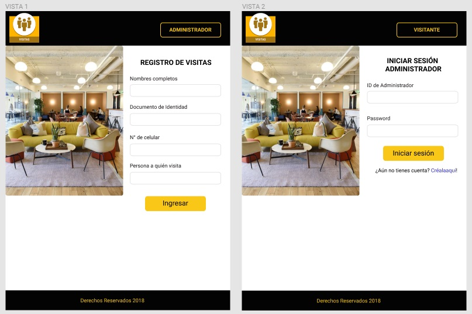
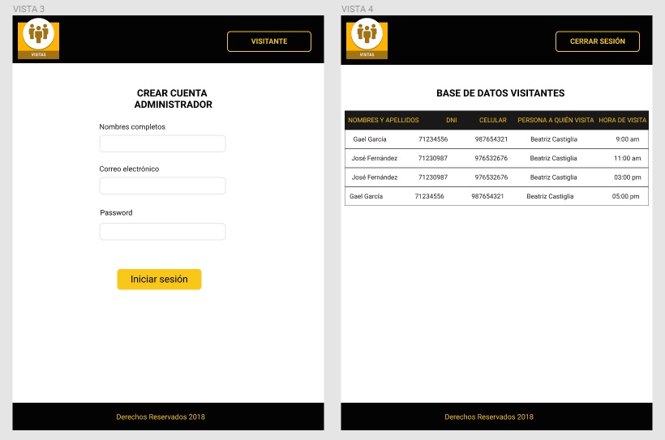
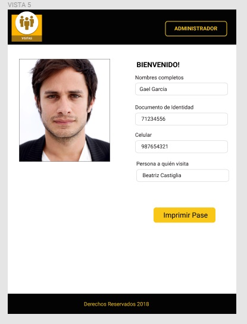
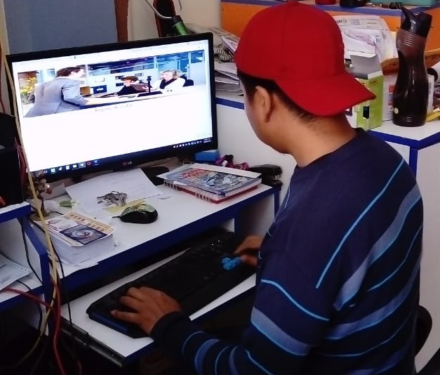
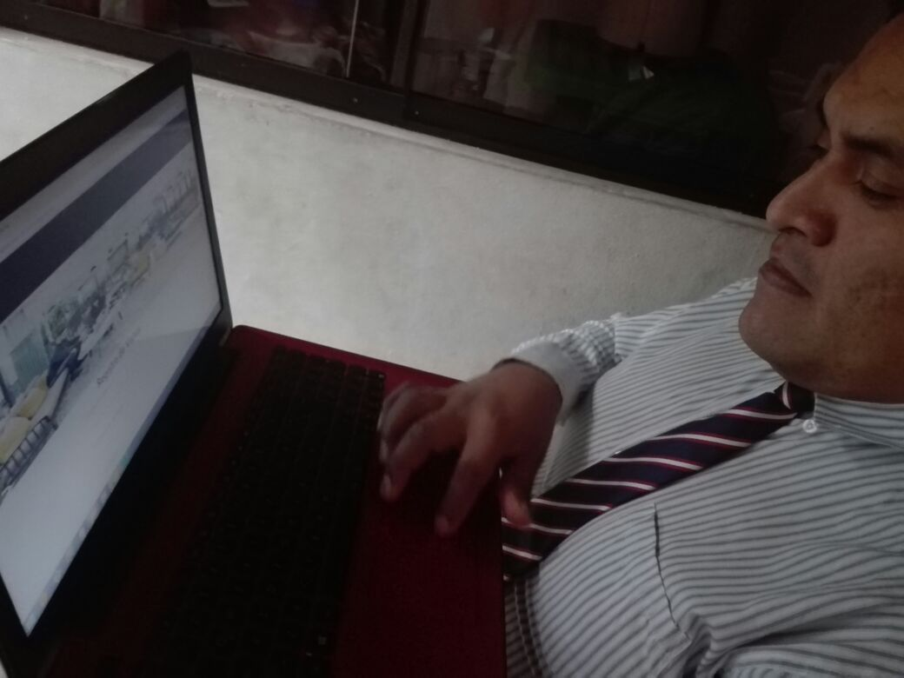

# We Work

## Introducción

En pleno siglo XXI de acuerdo al crecimiento del sector tecnológico, nos enfocamos en los grupos coworking de la ciudad de Lima 
que albergan dentro de sus instalaciones a muchas empresas u oficinas que diariamente reciben visitas tanto de clientes, proveedores 
y/o personas para ser entrevistadas por un puesto de trabajo. Lo que hace que el trabajo de la administración del coworking sea más 
cansado si es que no manejan un correcto sistema de comunicación o notificación de las visitas de sus usuarios. Por lo tanto nuestro objetivo 
es brindarle un sistema de registro digital de visitantes.

## Objetivos

1. El principal objetivo que cubre este proyecto es mejorar el sistema de registro de visitantes de los coworking del país, mejorando que la funcionalidad del sistema sea con un registro sencillo y rápido.

2. Brindar al visitante la información inmediata de ser recibido por la persona a quién busca.

3. Brindar a la persona visitada la información inmediata de la persona que lo busca para que pueda atenderlo.

4. Digitalizar las empresas coworking haciendo un uso eficiente de la tecnología.

## Usuarios

Los principales usuarios del proyecto son los grandes edificios donde funcionan muchas empresas y encuentran la solución en que sea la administración quien comunique sus visitas.

Por lo tanto identificamos a 3 personas a quiénes sirve este aplicativo los administradores de la empresa coworking, los visitantes y las personas visitadas.

## Implementación

Requisito para este proyecto es tener una colaboradora que trabaje la parte UX y dos colaboradoras que trabajen la parte front-end que abarquen sobretodo parte de las principales funcionalidades que son necesarias para este proyecto.

Para manejar mejor nuestra planificación elaboramos un proyecto en Trello en el cuál detallamos a través de *historias de usuarios* el manejo de las tareas a desarrollar, dividiendo nuestro trabajo en 3 fases: en proceso, bloqueo y en hecho.

### Desarrollo UX

Los principales requerimientos para este proyecto son los siguiente: Brenchmark, entrevistas, prototipo de baja fidelidad, prototipo de alta 
fidelidad, testing con prototipos.

### 1) Brenchmark

Se hizo un análisis de los principales aplicativos web que brindan los mismos servicios que nuestro aplicativo, con la finalidad de poder 
diferenciar nuestra marca. Como conclusión llegamos a que hay diversos aplicativos que son usados a nivel mundial, y el mercado nos muestra lo siguiente:

 * Existen diseños que permiten registrarte y se diferencian en el envío de las notificaciones, como es el caso de Startup bell.

 * Los siguientes aplicativos de la lista son de fácil uso ya que es un recurso importante que adquieren las empresas y se enfocan en que la funcionalidad del producto sea manejable por cualquier persona.

 * Ninguno de los aplicativos requiere que el registro sea usando datos personales de Facebook, Google o cualquier otra cuenta pues debe demostrarse veracidad de la persona que está llegando a visitar el establecimiento.

[Brenchmark](https://docs.google.com/document/d/1elPLeGZCs-NyloE5mAVZ8p4cOy6LR8o-26RlqXgtB6U/edit?usp=sharing)

### 2) Entrevistas

Se formularon 2 guías de entrevistas, para ser aplicadas a los administradores del coworking y a las personas visitadas.

[Click aquí para ver las entrevistas](https://docs.google.com/document/d/1dJTquPkIDlw9K5S_DPBNH0on4Lb_JxpUp1ofjq2Yqzc/edit?usp=sharing)

### 3) Prototipo de baja fidelidad

Con base a solucionar las principales necesidades del coworking se procedió a elaborar un prototipo a lápiz para poder testear 
nuestro proyecto con las personas que lo implementarian.

### 4) Prototipo de alta fidelidad

Con las correcciones de las sugerencias de nuestro prototipo de baja fidelidad se procedió a implementar todos los cambios a nuestro 
prototipo de alta fidelidad, siendo éste mostrado a través de Figma como herramienta de desarrollo.

En la interfaz mostramos el desenvolvimiento de los visitantes y administradores con el aplicativo.

[Prototipo en Figma](https://www.figma.com/proto/YrgBTs940tHYOolfBs2Hbzds/WE-WORK?node-id=22%3A65&scaling=scale-down)

### 5) Testing y conclusiones

* Héctor Urcia

Rol de Visitante: Cuando accedió al link le gustó el juego de colores porque remarcaba la seriedad de que los datos a registrar iban a ser usados de manera confidencial. No hubo problema para registrarse pues los mensajes estaban claros, pero cuándo registró su número de documento de identidad no sabía si tenía que seleccionar algo porque estaba habilitado un select.

* Juan Carlos Ticze

Rol de Administrador: Cuando accedió al link le pareció una interfaz adecuada para el tipo de funcionalidad que le daríamos al producto. No tuvo problema para buscar la opción a la que debería entrar pues estaba el botón con su función. Cuando registró sus datos no tuvo problema para acceder porque lo que le pedía el aplicativo era breve y así pudo acceder a la data de manera rápida.

Principales Recomendaciones

* Solucionar el problema de la sección de documento de identidad deshabilitando el select.

* Solucionar la validación de los botones, que validen primero que hay información dentro del recuadro antes de acceder a la siguiente vista a mostrar.

### Desarrollo Front-end

### 1) Crear conexión con Firebase

Para poder manipular la data que se creará cuando las personas se registren en nuestro aplicativo la conexión se realizará con firebase.

### 2) Elaborar el esqueleto en HTML

Como ya se cuenta con el prototipo de alta fidelidad se plasma la misma estructura en HTML usando varios < div > que separen nuestra 
estructura.

### 3) Elaboración de la base de datos

Al tener la conexión a Firebase, los datos que ingresen los visitantes quedará registrada en firebase, lo que permitirá que cuando los administradores quieran ver quiénes visitaron el edificio les sea proporcionada en una tabla de datos en tiempo real. Gracias a Firebase podemos tener este tipo de información almacenada.

### 4) Conexión con Mandrill app

El uso de *Mandrill* ayudará en que la persona visitada pueda ser notificada con un correo al momento de la registración de sus datos.

## Colaboradoras del proyecto:

* [Anaey Guillen](https://github.com/AnaeyGuillen/laboratoria-lim-Registro)

* [Génesis Nole](https://github.com/genesisnp/laboratoria-lim-Registro)

* [Leyla Ticze](https://github.com/ticze/laboratoria-lim-Registro)
