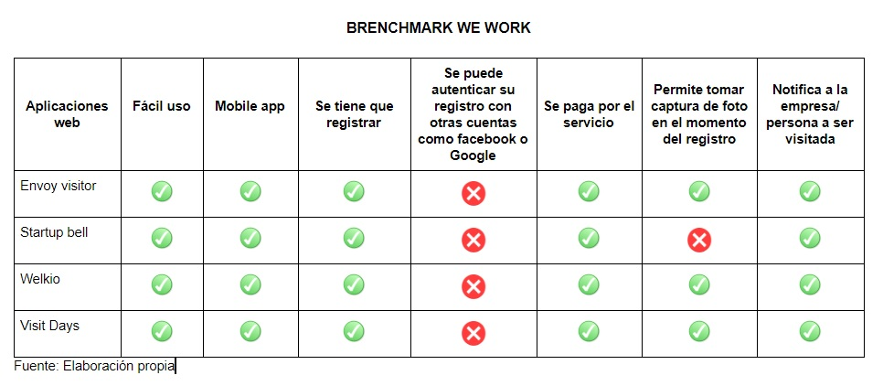

# We Work

## Introducción

En pleno siglo XXI de acuerdo al crecimiento del sector tecnológico, nos enfocamos en los grupos coworking de la ciudad de Lima 
que albergan dentro de sus instalaciones a muchas empresas u oficinas que diariamente reciben visitas tanto de clientes, proveedores 
y/o personas para ser entrevistadas por un puesto de trabajo. Lo que hace que el trabajo de la administración del coworking sea más 
cansado si es que no manejan un correcto sistema de comunicación o notificación de las visitas de sus usuarios. Por lo tanto nuestro objetivo 
es brindarle un sistema de registro digital de visitantes.

## Objetivos

El principal objetivo que cubre este proyecto es mejorar el sistema de registro de visitantes de los coworking del país, mejorando que 
la funcionalidad del sistema sea con un registro sencillo y rápido, y la notificación de la visita sea inmediata.

## Usuarios

Los principales usuarios del proyecto son los administradores de los coworking y las empresas que trabajen con ésta.

## Implementación

Requisito para este proyecto es tener una colaboradora que trabaje la parte UX y dos colaboradoras que trabajen la parte front-end que abarquen 
sobretodo parte de las principales funcionalidades que son necesarias para este proyecto.

### Desarrollo UX

Los principales requerimientos para este proyecto son los siguiente: Brenchmark, entrevistas, prototipo de baja fidelidad, prototipo de alta 
fidelidad, testing con prototipos.

### 1) Brenchmark

Se hizo un análisis de los principales aplicativos web que brindan los mismos servicios que nuestro aplicativo, con la finalidad de poder 
diferenciar nuestra marca. 

[Brenchmark](https://docs.google.com/document/d/1elPLeGZCs-NyloE5mAVZ8p4cOy6LR8o-26RlqXgtB6U/edit?usp=sharing)

### 2) Entrevistas

Se formularon 2 guías de entrevistas, para ser aplicadas a los administradores del coworking y a las personas visitadas.

[Entrevistas](https://docs.google.com/document/d/1dJTquPkIDlw9K5S_DPBNH0on4Lb_JxpUp1ofjq2Yqzc/edit?usp=sharing)

### 3) Prototipo de baja fidelidad

Con base a solucionar las principales necesidades del coworking se procedió a elaborar un prototipo a lápiz para poder testear 
nuestro proyecto con las personas que lo implementarian.

### 3) Prototipo de alta fidelidad

Con las correcciones de las sugerencias de nuestro prototipo de baja fidelidad se procedió a implementar todos los cambios a nuestro 
prototipo de alta fidelidad, siendo éste mostrado a través de Figma como herramienta de desarrollo.

### Desarrollo Front-end

### 1) Crear conexión con Firebase

Para poder manipular la data que se creará cuando las personas se registren en nuestro aplicativo la conexión se realizará con firebase.

### 2) Elaborar el esqueleto en HTML

Como ya se cuenta con el prototipo de alta fidelidad se plasma la misma estructura en HTML usando varios 
 que separen nuestra 
estructura.